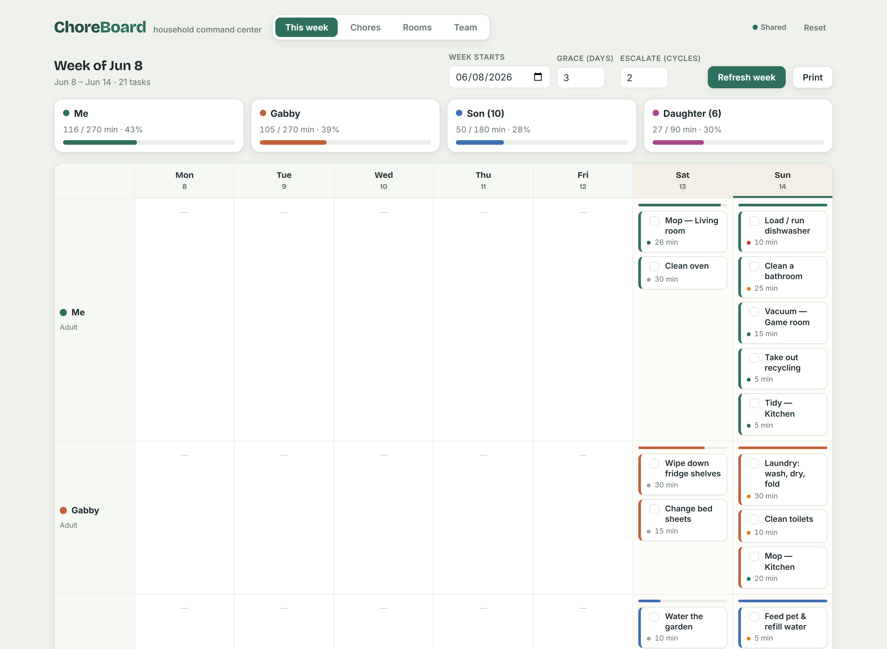

# ChoreBoard

A self-hosted household chore scheduler. You describe each chore (priority, duration,
cadence, who's allowed to do it) and your family's daily time budgets, and it generates a
balanced weekly assignment grid — packing each person's day up to their time budget,
respecting adult-only rules, and tracking what's overdue.

Built to run on a home server (e.g. a Synology NAS) and be opened from any family device on
the same network. State is shared: everyone sees and edits the same board.



## What it does

- **Smart weekly schedule.** Each person-day is a time bin (default 30 min weekdays / 60 min
  weekends, per-person). The engine packs due chores into bins, balancing load by *fraction of
  capacity* so kids aren't starved and adults aren't buried, and surfaces anything that won't fit.
- **Obligation + delinquency lifecycle.** A chore comes due on its cadence and is assigned to a
  *holder*. They have a grace window (default 3 days) to check it off. Miss it and it goes
  **delinquent** — pinned to the same person at the top of their day. After a configurable number
  of delinquency cycles, an auto-assigned chore **escalates to an adult**.
- **Flexible cadence.** Every *N* days / weeks / months / years, with real calendar math.
- **Per-chore assignment.** Lock a chore to one person, or let the scheduler auto-balance it.
- **Room × chore matrix.** Declare rooms (with sizes) and matrix chore types (Tidy, Vacuum, Mop…);
  generate one chore per compatible room×type cell. Duration scales with room size, and a
  compatibility grid lets you exclude combinations (e.g. don't mop a carpeted room).

## Quick start (local)

Requires **Node 18+**. No dependencies, no build step.

```bash
node server.js
# open http://localhost:8080
```

Run the engine tests:

```bash
npm test            # == node test/scheduler.test.js
```

You can also open `public/index.html` directly as a file — it falls back to per-device
`localStorage` (the top-right badge shows **Local only** instead of **Shared**). Running the
server is what makes the board shared across devices.

## Project layout

```
chore-board/
├── server.js              # zero-dependency static server + /api/state JSON store
├── package.json           # ES modules; "start" and "test" scripts; no runtime deps
├── public/
│   ├── index.html         # markup + tab shell
│   ├── styles.css         # all styling
│   ├── scheduler.js       # PURE engine: cadence, obligations, assignment, matrix (no DOM/IO)
│   └── app.js             # state, storage, rendering, event wiring (imports scheduler.js)
├── test/
│   └── scheduler.test.js  # node test runner for the pure engine
├── data/                  # runtime state.json (gitignored) — the shared source of truth
├── Dockerfile
└── docker-compose.yml
```

All scheduling logic lives in `public/scheduler.js` as pure functions and is covered by
`test/scheduler.test.js`. See `CLAUDE.md` for the architecture contract and `VISION.md` for the
roadmap and open design decisions.

## Deploy on a Synology NAS (StratoSaturn)

The recommended path is **Container Manager** (Docker), because it's self-contained and survives
DSM updates.

1. Copy this folder to a share, e.g. `/volume1/docker/chore-board/`.
2. In DSM open **Container Manager → Project → Create**.
   - Project name: `chore-board`
   - Path: the folder you copied
   - Source: **Use existing docker-compose.yml**
3. Build and run. The board is then at `http://<NAS-IP>:8080` from any device on the LAN.
4. (Optional) Give the NAS a reserved IP/hostname in your router so the URL is stable, and bookmark
   it on each family device's home screen.

Shared state persists to `./data/state.json` on the NAS (mounted into the container at `/data`),
so it survives container rebuilds. Back it up by copying that file, or just include the share in
your normal NAS backup.

### Without Docker

Container Manager isn't installed, or you'd rather not use it:

- **Node directly.** Install the Node.js package from Package Center, then run `node server.js`
  from the project folder (set `PORT`/`DATA_FILE` as needed). Use **Task Scheduler → triggered task
  (boot-up)** to start it automatically.
- **Web Station (static only).** Web Station can serve `public/` as a static site, but *static
  hosting can't share state* — every device would get its own private copy via `localStorage`.
  Only use this if you don't need a shared board.

## Configuration

| Env var     | Default            | Purpose                                  |
|-------------|--------------------|------------------------------------------|
| `PORT`      | `8080`             | Port the server listens on               |
| `DATA_FILE` | `./data/state.json`| Where shared state is persisted          |

## Notes & limits

- **Last-write-wins.** The whole board is one JSON document; concurrent edits from two devices can
  clobber each other. The app polls every 15s and on window focus to pull others' changes. Fine for
  a family; see `VISION.md` for the path to finer-grained sync if needed.
- **No authentication.** Intended for a trusted LAN. Don't expose it directly to the internet
  without putting auth/a reverse proxy in front.
